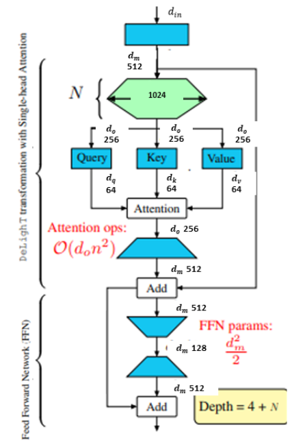
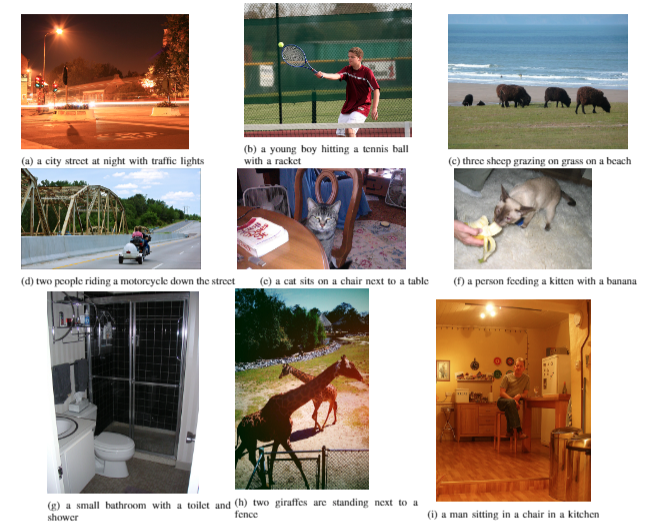

## Transformer Based Image Captioning, Final Project in Deep Learning 0510725502 TAU
This repository manly based on M²: Meshed-Memory Transformer code from the paper _[Meshed-Memory Transformer for Image Captioning](https://arxiv.org/abs/1912.08226)_ (CVPR 2020), full report of the improvments and additions made in our project can be found in 'report.pdf'.

```
<p align="left">
  
</p>
<p align="rigth">
  
</p>

## Environment setup
Clone the repository and create the `m2release` conda environment using the `environment.yml` file:
```
conda env create -f environment.yml
conda activate m2release
```

Then download spacy data by executing the following command:
```
python -m spacy download en
```

Note: Python 3.6 is required to run this code. 


## Data preparation
To run the code, annotations and detection features for the COCO dataset are needed. Please download the annotations file [annotations.zip](https://drive.google.com/file/d/1i8mqKFKhqvBr8kEp3DbIh9-9UNAfKGmE/view?usp=sharing) and extract it.

Detection features are computed with the code provided by [1]. To reproduce our result, please download the COCO features file [coco_detections.hdf5](https://drive.google.com/open?id=1MV6dSnqViQfyvgyHrmAT_lLpFbkzp3mx) (~53.5 GB), in which detections of each image are stored under the `<image_id>_features` key. `<image_id>` is the id of each COCO image, without leading zeros (e.g. the `<image_id>` for `COCO_val2014_000000037209.jpg` is `37209`), and each value should be a `(N, 2048)` tensor, where `N` is the number of detections. 

VC- feaeters, in order to add the extra featers, computed by [2], please download them from (https://drive.google.com/file/d/1O-JAYhdF3z8fkLivXZzllT8PotV1MlRv/view) and unzip.


## Training procedure
Run `python train.py` using the following arguments:

| Argument | Possible values |
|------|------|
| `--exp_name` | Experiment name|
| `--batch_size` | Batch size (default: 10) |
| `--workers` | Number of workers (default: 0) |
| `--m` | Number of memory vectors (default: 40) |
| `--head` | Number of heads (default: 8) |
| `--warmup` | Warmup value for learning rate scheduling (default: 10000) |
| `--resume_last` | If used, the training will be resumed from the last checkpoint. |
| `--resume_best` | If used, the training will be resumed from the best checkpoint. |
| `--features_path` | Path to detection features file |
| `--annotation_folder` | Path to folder with COCO annotations |
| `--logs_folder` | Path folder for tensorboard logs (default: "tensorboard_logs")|
| '--vc_features' | Path folder for new vc features |


For example, to train our model with the parameters used in our experiments, use
```
python train.py --exp_name m2_transformer --batch_size 50 --m 40 --warmup 10000 --features_path /path/to/features --annotation_folder /path/to/annotations --vc_features /path/to/vc
```

<p align="center">
  
</p>

#### References
[1] P. Anderson, X. He, C. Buehler, D. Teney, M. Johnson, S. Gould, and L. Zhang. Bottom-up and top-down attention for image captioning and visual question answering. In _Proceedings of the IEEE Conference on Computer Vision and Pattern Recognition_, 2018.

[2] Tan   Wang,   Jianqiang   Huang,   Hanwang   Zhang,   andQianru Sun.  Visual commonsense r-cnn.  InProceedingsof the IEEE/CVF Conference on Computer Vision andPattern Recognition, pages 10760–10770, 2020.
